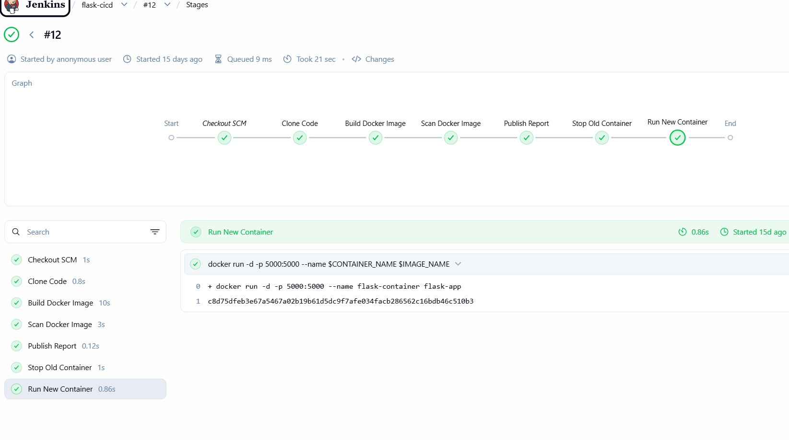
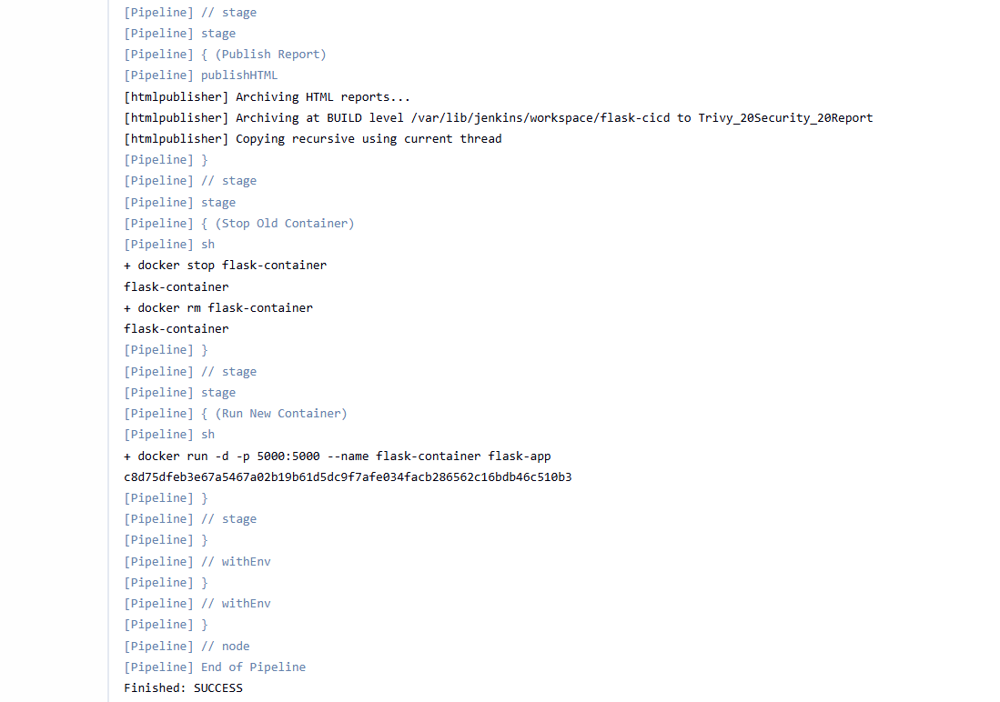
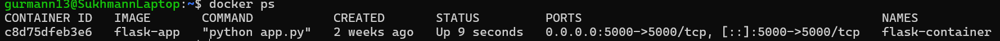

# DevSecOps CI/CD Pipeline — Jenkins + Docker + Trivy


---

## Why I built this

I kept reading about DevSecOps but everything I studied was theory — pipelines on slides, diagrams in textbooks. I wanted to actually build one and see what happens when things go wrong in a real build.

So I set up Jenkins locally, containerized a Flask app with Docker, and wired everything together. Then I added Trivy to scan the image before deployment — and that's when it got interesting. Trivy flagged real HIGH and CRITICAL CVEs in my base image. I had to go fix them, update dependencies, and re-run until the scan came back clean. That whole process taught me more than any course did.

This repo is the result of that.

---

## What it does

Code pushed to GitHub triggers a Jenkins pipeline that:
1. Pulls the latest code
2. Builds a Docker image from it
3. Runs a Trivy vulnerability scan on that image
4. Publishes the CVE report inside Jenkins (HTML Publisher plugin)
5. Deploys the container only if the scan passes

If there are HIGH or CRITICAL vulnerabilities, the build surfaces them before anything gets deployed. That's the whole point.

---

## The security part (this matters)

When I first ran Trivy against my Docker image, it came back with HIGH and CRITICAL CVEs in the base image I was using. I didn't just ignore them or mark them as exceptions — I actually fixed them. Upgraded the base image, updated the pinned dependencies in requirements.txt, and kept re-scanning until the vulnerability count dropped to zero.

I also hardened Jenkins itself — no anonymous access, RBAC enforced with proper user roles, authenticated sessions only. A lot of tutorials skip this part. I didn't want to build a secure pipeline sitting on top of an insecure Jenkins instance.

---

## Stack

- **Jenkins** — pipeline orchestration, running locally
- **Docker** — containerization
- **Trivy** — CVE scanning inside the pipeline
- **Python / Flask** — the application being deployed
- **GitHub** — source control + webhook trigger
- **HTML Publisher Plugin** — renders Trivy reports inside Jenkins UI

---

## Screenshots

### Jenkins Pipeline
*All 5 stages running — Checkout → Build → Trivy Scan → Report → Deploy*



---

### Build Logs (Console Output)
*Full console output showing successful image build and clean Trivy scan*



---

### Docker Container Running
*Flask app container live and accessible on port 5000*



---

### Trivy CVE Scan Report
*HTML Publisher report inside Jenkins — CVE severity breakdown after base image upgrade*


---

## Run it yourself

```bash
git clone https://github.com/Gurmann11/devops-project.git
cd devops-project

# Build the image
docker build -t devops-app .

# Run it
docker run -d -p 5000:5000 devops-app
```

Then open `http://localhost:5000`.

If you want to run the Trivy scan locally:

```bash
trivy image devops-app
```

You'll see CVE severity levels broken down by package. Try it on an older base image like `python:3.9` vs `python:3.9-slim-bookworm` and compare the output — the difference is significant.

---

## Project structure

```
devops-project/
├── Jenkinsfile          # pipeline stages — checkout, build, scan, deploy
├── Dockerfile           # how the container is built
├── app.py               # Flask app
├── requirements.txt     # Python deps
├── pipeline.png.png     # Jenkins pipeline screenshot
├── build-logs.png.png   # Console output screenshot
├── docker-container.png.png  # Docker container screenshot
├── Trivy Report.png.png # Trivy CVE scan report screenshot
└── README.md
```

---

## What I'd add next

Deploying this on a cloud instance is the obvious next step — right now it runs locally. I also want to try SonarQube for static analysis on the Python code itself, not just the image. And proper Slack alerts when a build fails would make this feel more like a real team setup.

---

**Gurmann Singh Dhillon** — gurmanndhillon84@gmail.com — [github.com/Gurmann11](https://github.com/Gurmann11)
